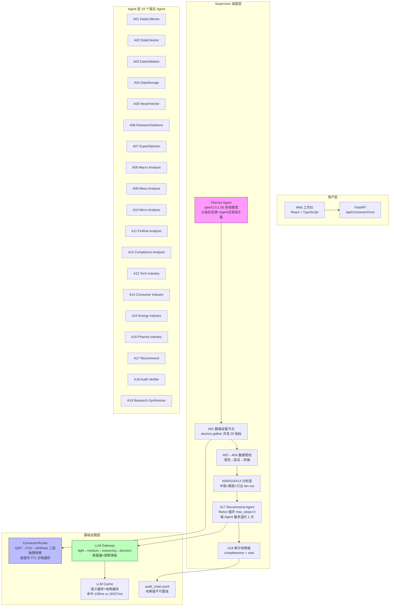
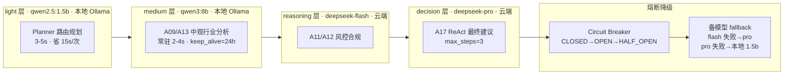

# Moss-FinAgent-Research

基于多Agent协作的AI辅助投研分析系统。面向二级市场投资决策，覆盖产业政策研究、产业链研究、个股研究三大模块，支持宏观、中观、微观三层分析，具备数据溯源与推理路径可回溯能力。

## 技术栈

LangGraph（Supervisor编排）+ FastAPI + React + Ollama（本地模型）+ DeepSeek API（云端推理）+ PostgreSQL/SQLite/Redis

## 系统架构

### Agent 编排（LangGraph StateGraph）



### LLM 路由分层



### 数据获取 & 缓存策略

```mermaid
flowchart LR
    subgraph 请求进入
        P0[指标请求: CPI, PE(TTM):300308, stock_close:300308 ...]
    end

    subgraph Router 缓存层
        TC{"分档 TTL 缓存<br/>命中?<br/>月频宏观→24h<br/>估值→12h<br/>行情→4h<br/>实时流动性→5min"}
        PLCK[Per-key Lock<br/>防缓存击穿]
    end

    subgraph Connector 链
        QMT[QMT XtMiniQmt<br/>QMT未启动→直接报 502]
        CSV[本地 CSV<br/>D:/quantTrader/data/SH/]
        Ak[AkShare HTTP<br/>新浪行情/NBS 宏观]
    end

    subgraph 硬约束
        NODOWNGRADE[真实源全失败<br/>绝不回退 simulated<br/>宁可报数据缺口]
    end

    P0 --> TC
    TC -- 命中 --> CACHE_HIT[返回缓存值]
    TC -- 未命中 --> PLCK
    PLCK --> QMT
    QMT -- DataFetchError --> CSV
    CSV -- DataFetchError --> Ak
    Ak -- 成功 --> WRITE_CACHE[写入 TTL 缓存]
    Ak -- 全失败 --> NODOWNGRADE
```

### 量化分析模块

```mermaid
flowchart TB
    subgraph 因子库 Factor Library
        FB[Factor 基类 + 注册器<br/>@register_factor 装饰器]
        FACTORS[PE(TTM) · 动量(12m/1m) · 反转 · Growth]
        PRE[预处理 三步<br/>MAD去极值 → z-score标准化 → 市值+行业中性化]
    end

    subgraph 因子分析 Factor Analyzer
        IC[IC / IR<br/>Spearman秩相关<br/>均值 / 标准差 = IR]
        QBT[5 分位分层回测<br/>H-L 多空年化收益 · 夏普 · 最大回撤]
        TUR[换手率分析<br/>Jaccard 相似度]
    end

    subgraph 风控 Risk
        VAR[VaR 历史模拟法<br/>1d / 10d · 方差]
        CVAR[CVaR (ES)<br/>左尾均值]
        STRESS[压力测试<br/>2015股灾 · 2020新冠 · UBS瑞信 · 美联储加息]
    end

    subgraph 组合 Portfolio
        PORT[等权 / 市值加权<br/>月度/季度调仓]
        BRINSON[Brinson 归因<br/>行业配置 + 个股选择 + 交互]
        SENSITIVITY[参数敏感性网格搜索<br/>eps_pct × PE_watermark × 成本]
    end

    FB --> FACTORS --> PRE --> IC
    PRE --> QBT
    QBT --> TUR
    VAR --> CVAR
    VAR --> STRESS
    PORT --> BRINSON
```

**关键设计决策（面试可讲）：**

| 决策 | 为什么这样 | Trade-off |
|------|-----------|-----------|
| LangGraph > AutoGen | 需要可控的 fan-out/fan-in（A09→A13 并行再汇总到 A17） | AutoGen 的 group chat 是黑盒 |
| Planner 用 qwen2.5:1.5b 不用 flash | 规划是分类任务，1.5b 本地 3-5s vs flash 18s | 牺牲极小精度换 15s/次 + 零 token 费 |
| Ollama keep_alive=24h | 模型常驻 GPU 内存 | 首次冷启动后保持，占 12GB GPU |
| 真实源失败不回退 simulated | 假数据进入最终建议比没数据更危险 | 偶尔需要手动补数据源 |
| OLS 加截距项 | 中性化无截距会把常数项吃进 beta | 多 1 列但更符合计量规范 |
| VaR 用历史模拟法 | 参数法假设正态太乐观 | 需要 ≥50 天样本 |

## 快速开始

```bash
# 1. 安装依赖
uv sync

# 2. 启动本地数据库（Demo初期先用SQLite）
docker compose up -d

# 3. 配置环境变量
cp .env.example .env   # 填入 DEEPSEEK_API_KEY 等

# 4. 启动API（本机使用8100端口）
$env:PYTHONPATH="."   # PowerShell；bash: export PYTHONPATH=.
uv run uvicorn src.api.main:app --port 8100

# 5. 运行测试
uv run pytest
```

## 演示与脚本

```powershell
# 七步导览（服务启动后，逐项PASS/FAIL，含风险声明）
$env:PYTHONPATH="."; uv run python scripts/demo_tour.py
# 追加真实行情回测步骤（全历史取数，可能数十秒）
uv run python scripts/demo_tour.py --with-backtest

# 演示前预热CPI/PPI数据（幂等，可重复执行）
uv run python scripts/seed_demo_data.py

# 四管线端到端工程冒烟（真实采集+Ollama降级链）
uv run python scripts/_smoke_e2e.py

# 回测引擎独立演示（默认601088中国神华；--synthetic 用确定性合成数据验证机制）
uv run python scripts/backtest_demo.py
```

回测为**纯本地规则计算**（无LLM、无未来函数），Web 工作台"策略回测"页提供
参数表单、净值曲线（内联SVG）、风险指标对比与固定风险免责声明。
朴素PPI动量规则在601088上实测跑输买入持有——回测子系统验证的是框架而非收益承诺。

## 文档索引

| 文档 | 内容 |
|------|------|
| AGENTS.md | 项目规则（每次开发会话自动加载） |
| docs/PRD.md | 需求总览 |
| docs/ARCHITECTURE.md | 系统架构 |
| docs/DEVELOPMENT_ROADMAP.md | 开发路线图与Backlog（B01付费接口/B02 GitHub待办） |
| docs/AGENT_REGISTRY.md | 18个Agent注册表 |
| docs/DATA_CONTRACT.md | 数据契约与溯源元数据 |
| docs/API_REFERENCE.md | HTTP接口参考（含调度/指标/回测） |
| docs/OBSERVABILITY.md | 指标、审计链与可观测性 |
| docs/SCHEDULER_DESIGN.md | 定时调度器设计 |
| docs/TROUBLESHOOTING.md | 常见问题排查 |

## 免责声明

本项目输出仅供技术研究，不构成投资建议。
