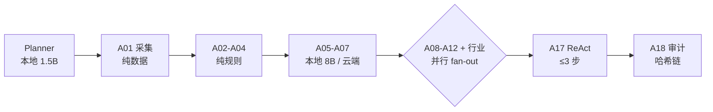

# Moss-FinAgent-Research

> 面向二级市场的 **多 Agent AI 投研系统**。覆盖产业政策 / 产业链 / 个股三层研究，
> 19 个 Agent 分工协作，全链路数据溯源与推理路径可回溯。

[](https://www.python.org/)
[](https://fastapi.tiangolo.com/)
[](https://react.dev/)
[](#测试)

---

## 目录

- [它能做什么](#它能做什么)
- [架构](#架构)
- [三个自己搭的基础设施](#三个自己搭的基础设施)
- [工程纪律](#工程纪律)
- [快速开始](#快速开始)
- [演示](#演示)
- [已知不足](#已知不足)
- [文档索引](#文档索引)

---

## 它能做什么

| 能力 | 说明 |
|---|---|
| **AI 投研分析** | 输入个股 → Planner 规划 → 数据采集/清洗/校验 → 信息层去伪与事件抽取 → 宏观/中观/微观/风控/合规并行分析 → 行业 Agent → ReAct 综合建议 → 审计封存 |
| **集合竞价选股** | 开市日 9:25:00 自动出池，12 维打分 + 10 条否决，规则可一张纸打印、单票可逐条溯源 |
| **做 T 辅助** | 分时买卖点、情绪周期研判、权重画像编辑 |
| **量化因子与回测** | 因子库（IC/IR、5 分位分层回测、换手率）、VaR/CVaR、历史压力测试、Brinson 归因、参数敏感性 |
| **量化选股 / 日 K 选股** | 三档模型定时选股；LightGBM 日 K 多因子选股写入自选股 |
| **资金流 / 板块拥挤度** | 大资金动向、概念板块近 6 年拥挤度水位与告警 |
| **告警** | 事件驱动告警，批量分类 + 批量打分两阶段（2 次 LLM 调用扫 30 条候选） |

---

## 架构

### 分层

```
src/
├── api/                    HTTP 接口层（16 个路由模块）
│   ├── routes/             research / quant / intraday / auction_select / fundflow / ...
│   └── runtime.py         进程内运行时装配（依赖注入、事件接线）
├── orchestration/          LangGraph StateGraph 编排 + Planner
├── domain/                 业务域（**不依赖 infrastructure 的具体实现**）
│   ├── agents/
│   │   ├── data/           A01 采集 · A02 清洗 · A03 校验 · A04 存储
│   │   ├── info/           A05 去伪 · A06 抽取 · A07 舆情
│   │   ├── analysis/       A08 宏观 · A09 中观 · A10 微观 · A11 风控 · A12 合规
│   │   ├── industry/       A13 科技 · A14 消费 · A15 周期 · A16 医药
│   │   ├── decision/       A17 建议（ReAct）
│   │   ├── audit/          A18 审计（哈希链，**零 LLM**）
│   │   └── engineering/    A19 代码工程师（自学习数据补充）
│   ├── intraday/  alerts/  skills/
├── infrastructure/         技术实现
│   ├── llm/                网关 · 缓存 · 断路器 · 审计 · providers
│   ├── connectors/         数据源连接器 + 路由（三级故障转移）
│   ├── repositories/       仓储实现
│   └── observability/      指标 · 审计链
├── quant/                  数据仓库 · 因子 · 回测 · 风控
├── auction_select/         集合竞价选股（规则表 + 位掩码引擎）
├── intraday/               做 T 辅助
├── backtest/  fundflow/  sector_crowding/  scheduler/
└── core/                   唯一权威层：配置 · 异常 · 取消令牌 · 共享口径
    ├── market_constants.py   市场口径常量（涨跌停 / 市值 / 年化交易日）
    ├── trading_session.py    A 股交易时段边界（09:15/09:30/11:30/13:00/15:00）
    ├── symbols.py            sh/sz 前缀换算（**只此一处**）
    ├── errors.py             brief(exc) 三档截断（摘要 120 / 响应 200 / 日志 500）
    ├── tenancy.py  policy.py 多租户身份 · RBAC×ABAC×中国墙
    └── redaction.py          日志与异常文案脱敏

auction_select/config.yaml     ← 模块配置与代码分离：
sector_crowding/config.yaml       配置留在各自模块目录，与 src/ 下的包同名对应
configs/                       全局配置（模型路由 / 数据源 / 策略源）
```

**依赖方向**：`api → orchestration → domain → infrastructure`（单向）。
`domain` 只依赖 `infrastructure` 暴露的**接口**，具体实现由 `api/runtime.py` 注入。

### 一次投研分析的调用链



---

## 三个自己搭的基础设施

### 1 · LLM 网关（`src/infrastructure/llm/`，约 800 行）

**架构红线：所有 LLM 调用必须过网关，禁止 Agent 直连模型 API。**

```
complete(tier, system, prompt)
  ├─ 取消令牌检查      调用前拦截，用户点停止后不再产生费用
  ├─ 输入截断          保头保尾（尾部是指令与 JSON schema）
  ├─ 缓存              精确 + 语义两级，按「模型层级 + json_mode + agent」分区
  ├─ token 预算        单任务累计超限直接拒绝
  └─ 降级链            熔断器准入 → 主模型 → 备模型，全程落审计
```

配套：断路器（provider 级状态机）、语义缓存、prompt/response 哈希审计链、
按层级的模型路由。

### 2 · 数据连接器路由（`src/infrastructure/connectors/`）

```
分档 TTL 缓存 → per-key lock（防击穿） → QMT → CSV → AkShare → 报数据缺口
```

- **分档 TTL**：月频宏观 24h / 估值 12h / 行情 4h / 实时流动性 5min。
- **硬约束**：真实源全失败时**绝不回退 simulated**，宁可报缺口。
  假数据进了投研建议，比"这次没数据"危险得多。

### 3 · 自学习数据补充（`DataGapResolverAgent`）

```
指标无数据 → LLM 生成 connector
                ├─ ① AST 静态校验（禁 import os/subprocess、禁 eval）
                └─ ② 子进程沙箱冒烟（15s 超时）
                      ↓ 双通过
                    落库注册，后续复用
```

> ⚠️ 沙箱是**子进程级隔离，不是安全容器**。只适合"半信任"的生成代码在小规模
> 数据源上使用。这一点在 `docs/CODE_AUDIT_CHECKLIST.md` 里写明了边界。

---

## 工程纪律

| 纪律 | 落地方式 |
|---|---|
| **可复现** | 取数一律按 `trade_date` 钉死，不用"实时时钟"倒推历史 |
| **不猜** | 数据缺失时置 `None` 并记 `degraded`，绝不用 0 或中性值冒充 |
| **可追溯** | 每个数据点带 `source_url / publish_time / fetch_time / raw_content_hash`；LLM 调用带 `prompt_hash / token / 延迟 / 降级链` |
| **纯重构要有黄金回归** | 集合竞价选股重构时，用冻结行情录像带做 **47 只 × 12 维逐位比对**，并加**性能门禁**单测 |
| **规则可读** | 判定规则收敛成声明式表，`python -m src.auction_select.rulebook --dump` 一张纸打印全部规则 |
| **测试** | 2500+ 单测（`tests/unit`，134 个文件） |

### 一次真实的重构（可作面试案例）

集合竞价选股的判定原本散在 4 个文件、**329 处 `if/elif`**，且存在隐性顺序约束
（"规则 6 必须先于规则 5"）。重构为**规则总表 + 位掩码引擎**：

| 指标 | 重构前 | 重构后 |
|---|---:|---:|
| 规则可读性 | 跨 4 文件 3853 行 | `--dump` 一张纸 |
| 隐性顺序耦合 | 有 | **0**（Pass1 打标签 / Pass2 否决，两遍纯函数） |
| 决策链路耗时 | 1231 ms | **36 ms（34×）** |
| 行为一致性 | — | 黄金回归 **564 处逐位一致** |

> **最关键的一条**：性能瓶颈其实**不在规则**（规则只占 8.1 ms / 0.66%），
> 而在生态序列每轮读三张全市场表（1223 ms / 99.3%）。
> 优化对象是"把一天一变的结果挪出热路径"，不是优化规则本身。

---

## 快速开始

```bash
# 1. 依赖
uv sync

# 2. 启动本地数据库（Demo 阶段用 SQLite，PostgreSQL/Redis 可选）
docker compose up -d

# 3. 环境变量
cp .env.example .env      # 填 DEEPSEEK_API_KEY 等

# 4. 启动 API（本机 8100）
$env:PYTHONPATH="."       # bash: export PYTHONPATH=.
uv run uvicorn src.api.main:app --port 8100
# 或用管理脚本（后台 + 日志 + 优雅重启）
uv run python manage.py start --replace --daemon

# 5. 测试
uv run pytest
```

---

## 演示

```powershell
# 七步导览：逐项 PASS/FAIL，含风险声明（演示开场推荐）
.\.venv\Scripts\python.exe scripts/demo_tour.py

# 预热演示数据（幂等）
.\.venv\Scripts\python.exe scripts/seed_demo_data.py

# 规则总表 / 单票判定溯源
.\.venv\Scripts\python.exe -m src.auction_select.rulebook --dump
.\.venv\Scripts\python.exe -m src.auction_select.rulebook --explain 600630 --trade-date 20260918

# 端到端工程冒烟
.\.venv\Scripts\python.exe scripts/_smoke_e2e.py

# 回测引擎独立演示（--synthetic 用确定性合成数据验证机制）
.\.venv\Scripts\python.exe scripts/backtest_demo.py
```

**完整演示动线见 [`docs/DEMO_GUIDE.md`](docs/DEMO_GUIDE.md)。**

---

## 已知不足

不粉饰，主动列出来：

| 不足 | 现状 | 改进路径 |
|---|---|---|
| **单进程 + SQLite** | Demo 阶段的刻意选择（零依赖好部署） | 仓储层已抽象，换 PostgreSQL 只改配置 |
| **语义缓存是字符 3-gram 余弦** | 轻量无依赖，长 prompt 下区分度下降 | 换 embedding + 向量库；长 prompt 下关闭语义层只留精确层 |
| **成本核算链路未闭环** | `models.yaml` 写了定价块但网关不读，只统计 token 不折钱 | 网关侧按 token × 单价写 `cost_yuan` 进审计 |
| **大文件** | `src/intraday/service.py` 2526 行、`src/auction_select/sources.py` 1482 行 | 按职责拆分（见 `docs/PROJECT_AUDIT_2026-09-19.md`） |
| **没有 CI** | 本地跑 `pytest` | 加 GitHub Actions：lint + 单测 + 黄金回归 |
| **回测无实盘验证** | 三档模型回测有**样本内声明**与滑点敏感性 | 滚动样本外 + 交易成本细化 |

---

## 文档索引

| 文档 | 内容 |
|---|---|
| [`docs/ARCHITECTURE.md`](docs/ARCHITECTURE.md) | 系统架构 |
| [`docs/PRD.md`](docs/PRD.md) | 需求总览 |
| [`docs/RESUME_PROJECT.md`](docs/RESUME_PROJECT.md) | **简历项目介绍（两版 + 面试问答）** |
| [`docs/DESIGN_HIGHLIGHTS.md`](docs/DESIGN_HIGHLIGHTS.md) | **设计亮点与难点** |
| [`docs/DEMO_GUIDE.md`](docs/DEMO_GUIDE.md) | **演示动线与话术** |
| [`docs/PROJECT_AUDIT_2026-09-19.md`](docs/PROJECT_AUDIT_2026-09-19.md) | **性能 / Token / 代码规范审计 + 面试欠缺分析** |
| [`docs/AUCTION_SELECT.md`](docs/AUCTION_SELECT.md) | 集合竞价选股（规则总表、口径核验、不采用的规则） |
| [`docs/INTRADAY_T_DESIGN.md`](docs/INTRADAY_T_DESIGN.md) | 做 T 辅助模块设计 |
| [`docs/QUANT_DATA_WAREHOUSE.md`](docs/QUANT_DATA_WAREHOUSE.md) | 量化数据仓库 |
| [`docs/QUANT_M2_FACTORS.md`](docs/QUANT_M2_FACTORS.md) | 因子库与 IC/IR |
| [`docs/QUANT_M4_SINGLE_BACKTEST.md`](docs/QUANT_M4_SINGLE_BACKTEST.md) | 单标的回测 |
| [`docs/SHORTTERM_BACKTEST.md`](docs/SHORTTERM_BACKTEST.md) | 短线回测 |
| [`docs/SECTOR_CROWDING.md`](docs/SECTOR_CROWDING.md) | 板块拥挤度 |
| [`docs/FUND_FLOW_MONITOR.md`](docs/FUND_FLOW_MONITOR.md) | 资金流监控 |
| [`docs/API_REFERENCE.md`](docs/API_REFERENCE.md) | HTTP 接口参考 |
| [`docs/OBSERVABILITY.md`](docs/OBSERVABILITY.md) | 指标、审计链与可观测性 |
| [`docs/SECURITY_COMPLIANCE.md`](docs/SECURITY_COMPLIANCE.md) | 安全合规 |
| [`docs/TROUBLESHOOTING.md`](docs/TROUBLESHOOTING.md) | 常见问题排查 |
| [`docs/DEVELOPMENT_ROADMAP.md`](docs/DEVELOPMENT_ROADMAP.md) | 路线图与 Backlog |

---

## 免责声明

本项目输出仅供技术研究，**不构成投资建议**。回测结果不预示未来收益。
