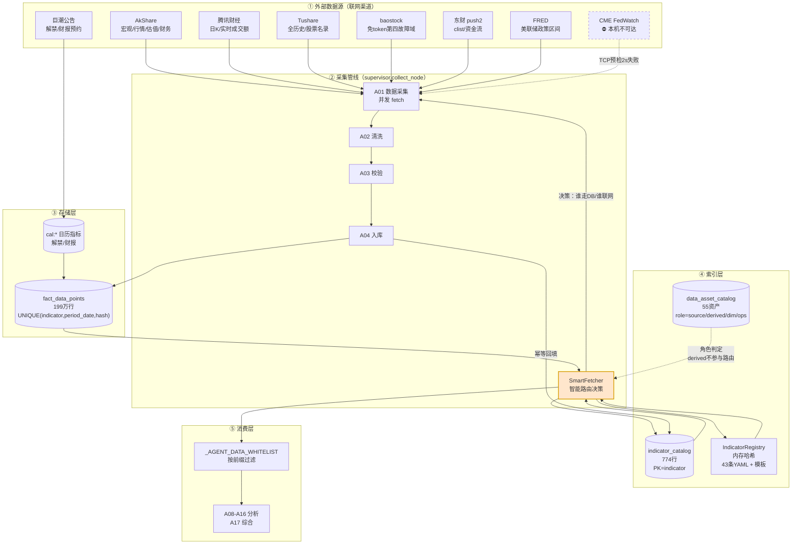
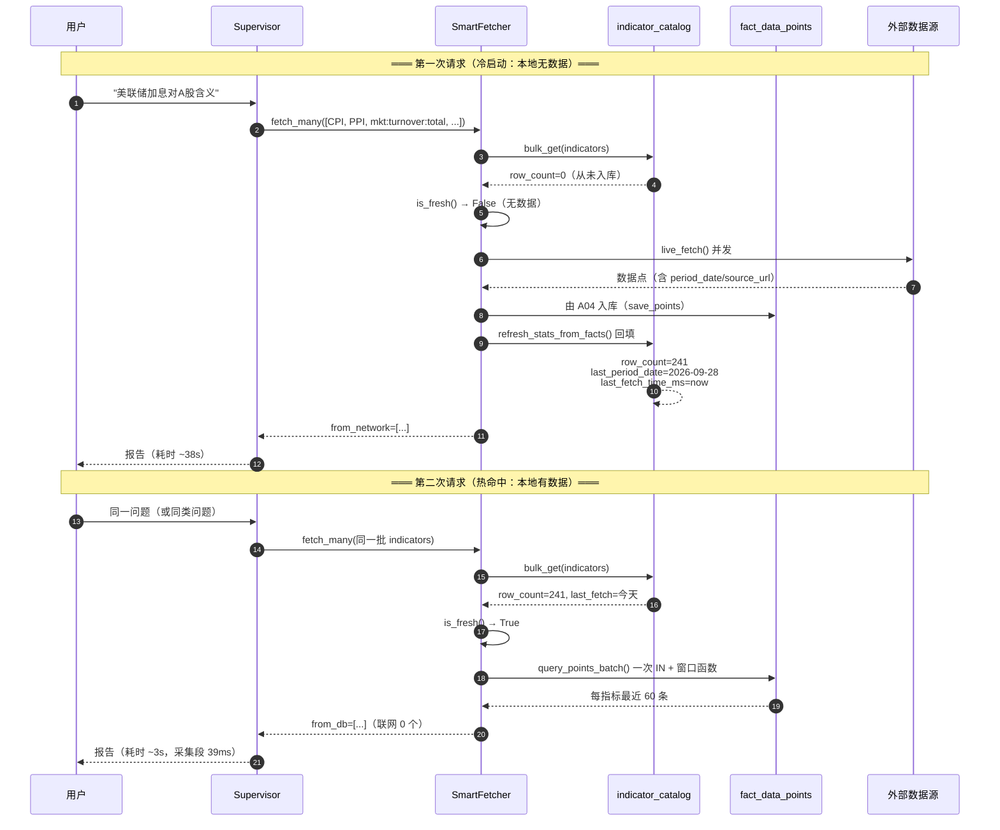
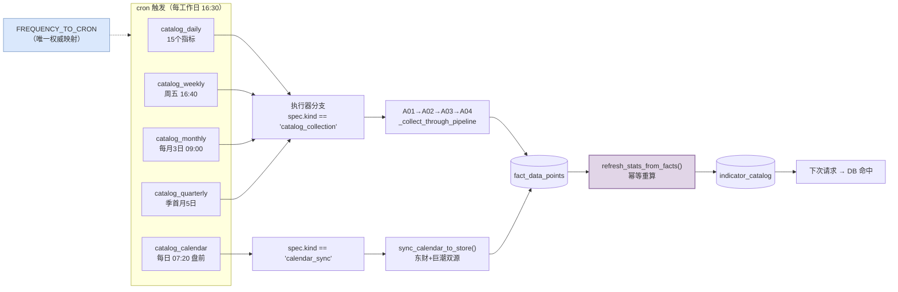

# 投研分析 · 数据采集依赖与获取路径流程图

> 全部流程**逐行核对代码**得出，非设计稿。
> 核对日期：2026-09-28
> 关键文件：`src/infrastructure/catalog/smart_fetch.py`、`catalog_repo.py`、
> `registry.py`、`market_calendar.py`、`src/orchestration/supervisor.py::collect_node`

---

## 〇、先纠正一个术语（避免误解实现）

你说的「**精准哈希检索本地数据库字段**」——准确表述是：

| 层 | 实际机制 | 实测耗时 | 为什么不是"哈希" |
|---|---|---|---|
| **元数据层**（内存） | `IndicatorRegistry` 的 `dict` 哈希 + 分段索引 | **1.19 μs** | ✅ 这一层**是**哈希 |
| **索引表层**（SQLite） | `indicator_catalog.indicator` 是 **PRIMARY KEY** → B-tree 索引查找 | 亚毫秒 | ❌ 是 B-tree，不是哈希 |
| **事实表层**（SQLite） | `fact_data_points` 的 `idx_points_indicator_period` **复合索引** | ~2ms/30 指标 | ❌ 是 B-tree |

**为什么不用真哈希表**：数据在磁盘上、要支持 `IN (...)` 批量、要范围查询
（`period_date >= ?`）。SQLite 的 B-tree 索引对这些场景比"自己建哈希表"更合适
（哈希表不支持范围查询，且要全量载入内存）。

**但"精确匹配"这个本质你是对的** —— 三层都是**等值/前缀精确匹配**，
不做模糊扫描。模糊（n-gram）只在**精确 miss 时**才作为兜底触发（见 §5）。

---

## 一、全景依赖图（数据从哪来 → 到哪去）



---

## 二、核心决策流程：本地有数据 vs 没数据（**两个闭环**）

```mermaid
flowchart TD
    START(["投研请求<br/>e.g. 美联储加息对A股含义"]) --> PLAN["Supervisor 规划<br/>plan_run → indicators[]"]

    PLAN --> EXPAND{"是聚合指标吗?<br/>如 mkt:cybkcb:turnover:all"}
    EXPAND -->|是| DOEXP["展开为子指标<br/>turnover:cyb/kcb/kcb_all"]
    EXPAND -->|否| KEEP["保持原样"]
    DOEXP --> LOOKUP
    KEEP --> LOOKUP

    LOOKUP["🔍 第1步：精确检索<br/>① 内存哈希 registry.get()<br/>② SQL: catalog.bulk_get()<br/>WHERE indicator IN (...)"] --> HIT{"catalog 里有<br/>这个指标吗?"}

    HIT -->|❌ 没有| AUTOREG["自动登记元数据<br/>frequency=daily<br/>freshness=24h<br/>（兜底值，后续会修正）"]
    AUTOREG --> FRESHCHK
    HIT -->|✅ 有| FRESHCHK

    FRESHCHK{"🔍 第2步：新鲜度判定<br/>FreshnessState.is_fresh()<br/>age = now - last_fetch_time"}

    FRESHCHK -->|"age ≤ freshness_hours"| FRESH["✅ FRESH<br/>本地数据够新"]
    FRESHCHK -->|"age > freshness_hours"| SESSION{"🔍 第2.5步<br/>非盘中 + 行情类指标?"}
    FRESHCHK -->|"row_count = 0"| STALE

    SESSION -->|"是 + 数据日期=最近交易日"| FRESH
    SESSION -->|否| STALE["⚠️ STALE<br/>需要联网"]

    %% ============ 闭环 A：本地有数据 ============
    FRESH --> QDB["🔍 第3步：批量取数<br/>query_points_batch()<br/>ROW_NUMBER() OVER<br/>(PARTITION BY indicator<br/> ORDER BY period_date DESC)<br/>→ 每指标最近 N 条"]
    QDB --> HASROW{"真的取到<br/>数据了吗?"}
    HASROW -->|✅ 有| RETDB["返回数据点<br/>from_db.append(ind)"]
    HASROW -->|"❌ 空<br/>（被prune/不一致）"| STALE

    RETDB --> WHITELIST["白名单过滤<br/>_AGENT_DATA_WHITELIST"]
    WHITELIST --> ANALYZE["A08-A16 分析<br/>→ A17 综合"]
    ANALYZE --> REPORT["最终报告"]

    %% ============ 闭环 B：本地没数据 ============
    STALE --> NET["🌐 第4步：联网取数<br/>live_fetcher → A01<br/>并发 fetch"]
    NET --> NETOK{"取到数据?"}
    NETOK -->|❌ 失败| GAP["记录缺口<br/>（不阻断主链路）"]
    NETOK -->|✅ 成功| A04STORE["A04 入库<br/>save_points()"]

    A04STORE --> FIELDS["落库字段（溯源四件套）<br/>· indicator<br/>· value<br/>· period_date<br/>· source_name / source_url<br/>· fetch_time / publish_time<br/>· raw_content_hash"]
    FIELDS --> BACKFILL["🔁 索引回填<br/>refresh_stats_from_facts()<br/>SELECT COUNT(*), MAX(period_date)<br/>FROM fact_data_points<br/>WHERE indicator IN (...)"]
    BACKFILL --> UPDIDX["更新 indicator_catalog<br/>· row_count = COUNT<br/>· last_period_date = MAX<br/>· last_fetch_time_ms = now"]
    UPDIDX --> RETNET["返回数据点<br/>from_network.append(ind)"]
    RETNET --> WHITELIST

    GAP --> WHITELIST

    %% ============ 闭环 C：频率自学习 ============
    UPDIDX -.->|"重建索引时"| INFER["🧠 频率推断<br/>infer_frequency_from_periods()<br/>取相邻 period_date 中位间隔"]
    INFER -.->|"间隔≤2天 → daily/26h<br/>≤45天 → monthly/720h<br/>≤120天 → quarterly/2160h"| UPDIDX

    style FRESH fill:#d5e8d4,stroke:#82b366,stroke-width:2px
    style STALE fill:#ffe6cc,stroke:#d79b00,stroke-width:2px
    style QDB fill:#dae8fc,stroke:#6c8ebf,stroke-width:2px
    style NET fill:#fff2cc,stroke:#d6b656,stroke-width:2px
    style BACKFILL fill:#e1d5e7,stroke:#9673a6,stroke-width:2px
    style INFER fill:#e1d5e7,stroke:#9673a6,stroke-width:2px
```



---

## 三、时序图（首次冷启动 → 第二次热命中）



---

## 四、定期调度闭环（数据不会"永远停在第一次"）



**频率 → cron 映射（`catalog_jobs.py`，唯一权威）**：

| frequency | cron | 覆盖指标数 |
|---|---|---|
| `realtime` | **不建作业**（请求时现拉） | 6 |
| `intraday` | `*/30 9-15 * * 1-5` | 0 |
| `daily` | `30 16 * * 1-5` | 15 |
| `weekly` | `40 16 * * 5` | 2 |
| `monthly` | `0 9 3 * *` | 15 |
| `quarterly` | `0 9 5 1,4,7,10 *` | 5 |
| `yearly` | `0 9 20 1 *` | 0 |
| `calendar`（专用） | `20 7 * * 1-5` | 4 |

**覆盖率自检：42/48 被覆盖，未覆盖 0** ✅

---

## 五、三层索引的职责边界（**不要混为一谈**）

```
┌─────────────────────────────────────────────────────────────────┐
│ ① IndicatorRegistry（内存哈希）                                  │
│    来源：configs/indicators.yaml（43条 + 7模板）                  │
│    回答：「这个指标该多久更新、数据在哪、怎么匹配」                 │
│    匹配：精确 → 分段哈希 O(1) → 模板通配 → n-gram 兜底(仅miss时)   │
│    实测：1.19 μs/lookup                                          │
├─────────────────────────────────────────────────────────────────┤
│ ② indicator_catalog（SQLite 表，774行）                          │
│    来源：YAML 元数据 + 运行时回填                                 │
│    回答：「这个指标**现在**新不新、有多少行、上次什么时候取的」      │
│    字段：row_count / last_period_date / last_fetch_time_ms        │
│          + storage_backend / storage_location（数据在哪）         │
│    匹配：PK 索引，WHERE indicator IN (...)                        │
├─────────────────────────────────────────────────────────────────┤
│ ③ data_asset_catalog（SQLite 表，55资产）                        │
│    来源：自动扫描（sqlite_master + 目录递归）                      │
│    回答：「本地到底有哪些数据、各是什么角色」                      │
│    角色：source(9) / derived(16) / dim(14) / ops(16)              │
│    ★ derived 不参与取数路由（如 sector_crowding_daily 218万行）    │
└─────────────────────────────────────────────────────────────────┘
```

---

## 六、你这个需求 vs 当前实现的对照

| 你的要求 | 实现状态 | 证据 |
|---|---|---|
| **① 先精准检索本地数据库字段** | ✅ 已实现 | 三层精确匹配（内存哈希 + 2 个 SQL 索引）；`scripts/bench_lookup_methods.py` 实测 0.32μs |
| **② 没有再去联网搜** | ✅ 已实现 | `SmartFetcher` 的 fresh/stale 分流；`from_db` / `from_network` 分开统计 |
| **③ 搜到后存字段数据** | ✅ 已实现 | `A04` 落库，溯源四件套（source_name/url/fetch_time/hash） |
| **④ 存数据来源** | ✅ 已实现 | `source_name` + `source_url` + `source_type` |
| **⑤ 存最后一次更新日期** | ✅ 已实现 | `indicator_catalog.last_fetch_time_ms` + `last_period_date` |
| **⑥ 存更新周期（日更/周更）** | ✅ 已实现 | `frequency` 字段；**且能从数据间隔自学习**（`frequency_infer.py`） |
| **⑦ 定期调度更新** | ✅ 已实现 | `catalog_jobs.py` 生成 4 个作业 + 1 个日历专用作业；覆盖率 42/48 |

**关键实测数字**：

| 场景 | 采集段耗时 | 联网指标数 |
|---|---:|---:|
| 冷启动（全 stale） | **13,100 ms** | 3 |
| 热命中（全 fresh） | **39 ms** | **0** |

---

## 七、⚠️ 诚实登记：三个已知缺口

> 按新 skill（`requirement-closure-and-impact`）§4.2 的要求，交付必须附"还差什么"。

### 缺口 1：A17 发现的缺口接不到 A19（**跨轮次补取未打通**）

```
当前：A01 采不到 → _try_self_heal() → A19 生成连接器   ✅ 已通
缺口：A17 在 data_gaps 里说"缺 X" → ??? → A19            ❌ 未接
```

**影响**：A17 说"缺解禁数据"时，系统**不会自动去补**，只能等下次定时作业。
**为什么难**：这是**跨轮次**能力（本次分析用不上，下次能用），要设计"缺口排队 → 盘后批量补 → 回填索引"。

### 缺口 2：`realtime` 类指标（6 个）没有定时作业

```
mkt:turnover:total / mkt:turnover_rate:all_a / mkt:cybkcb:turnover:all
fed:policy_range / fed:rate_prob:next / mkt:cybkcb:spot_summary
```

**这是**设计上**不建作业**（靠请求时现拉 + A04 顺带落库），**不是遗漏**。
但代价是：**当天第一个请求仍要付网络往返**（实测 `mkt:turnover:total` 0.17s，可接受）。

### 缺口 3：`fed:rate_prob:next` 永远取不到

```
CME www.cmegroup.com:443 → TCP 预检 2s 失败（本机确定性不可达）
```

**已登记为 `unavailable`**（`capabilities.py`），并给出替代：`fed:policy_range`（FRED，可达）。
**不是系统缺陷，是网络环境限制** —— 应在 A17 结论里如实说明，而不是报"数据缺失"。

---

## 八、一页纸速查

```
【冷启动：本地无数据】
  请求 → 规划 → 精确检索（miss）→ 新鲜度判定（stale）
       → 联网并发 fetch → A04 入库（含溯源+来源+日期）
       → 索引回填（row_count/last_fetch/frequency）
       → 白名单过滤 → 分析 → 报告          耗时 ~13-38s

【热命中：本地有数据】
  请求 → 规划 → 精确检索（hit）→ 新鲜度判定（fresh）
       → 批量 SQL 取数（一次 IN + 窗口函数）
       → 白名单过滤 → 分析 → 报告          耗时 ~39ms（采集段）

【定期更新】
  cron（按 frequency）→ 批量采集 → 入库 → 索引回填
  → 下次请求自动变成"热命中"

【频率自学习】
  首次自动登记 = daily/24h（兜底）
  重建索引时从 period_date 间隔反推真实频率
  （日频/周频/月频/季频）→ 修正兜底值
```

---

## 附：核对过的代码位置

| 环节 | 文件:行 |
|---|---|
| 智能路由决策 | `src/infrastructure/catalog/smart_fetch.py:150-215` |
| 新鲜度判定 | `src/infrastructure/catalog/registry.py`（`FreshnessState.is_fresh`） |
| 交易时段感知 | `src/infrastructure/catalog/market_calendar.py` |
| 批量取数（窗口函数下推） | `src/infrastructure/repositories/macro_repo.py::_query_batch_sync` |
| 索引回填（幂等） | `src/infrastructure/catalog/catalog_repo.py::refresh_stats_from_facts` |
| 频率自学习 | `src/infrastructure/catalog/frequency_infer.py` |
| 采集节点 | `src/orchestration/supervisor.py::collect_node` |
| 白名单过滤 | `src/orchestration/supervisor.py::_filter_points_for_agent` |
| 作业生成 | `src/scheduler/catalog_jobs.py` |
| 执行器分支 | `src/scheduler/jobs.py`（`catalog_collection` / `calendar_sync`） |
| 端到端审计 | `scripts/audit_data_index.py`（7/7 通过） |
